# 📦 Predicting Delivery Risks in Supply Chains Using Machine Learning

[](https://www.python.org/downloads/)
[](https://scikit-learn.org/)
[](https://opensource.org/licenses/MIT)
[](https://www.kaggle.com/datasets/shashwatwork/dataco-smart-supply-chain-for-big-data-analysis)
[](https://www.iitk.ac.in/)

> **A comprehensive, leakage-aware empirical framework integrating supervised machine learning, cost-sensitive optimization, unsupervised market segmentation, and statistical mechanics (Markov transitions, Shannon entropy, and Bullwhip dynamics) to forecast order delivery failure across 180,519 global supply chain transactions.**

---

## 📌 Table of Contents

- [Executive Summary](#-executive-summary)
- [Key Findings & Operational Insights](#-key-findings--operational-insights)
- [Dataset & Anti-Leakage Architecture](#-dataset--anti-leakage-architecture)
- [End-to-End Analytics Pipeline](#-end-to-end-analytics-pipeline)
- [Exploratory Data Analysis & Diagnostics](#-exploratory-data-analysis--diagnostics)
- [Mathematical Formulation of Algorithms](#-mathematical-formulation-of-algorithms)
- [Model Performance & Comparative Benchmarks](#-model-performance--comparative-benchmarks)
- [Interpretability & Feature Importance](#-interpretability--feature-importance)
- [Unsupervised Operational Segmentation (K-Means)](#-unsupervised-operational-segmentation-k-means)
- [System Dynamics & Statistical Physics](#-system-dynamics--statistical-physics)
- [Cost-Sensitive Business Framework](#-cost-sensitive-business-framework)
- [Actionable Recommendations for Supply Chain Leaders](#-actionable-recommendations-for-supply-chain-leaders)
- [Repository Structure](#-repository-structure)
- [Quick Start & Reproducibility](#-quick-start--reproducibility)
- [Author & Acknowledgments](#-author--acknowledgments)

---

## 🌟 Executive Summary

Late deliveries in global supply chains trigger cascading disruptions: stockouts, bullwhip inventory swings, liquidated customer goodwill, and punitive SLA chargebacks. Traditional industrial heuristics rely on static threshold rules that fail to capture nonlinear interdependencies between fulfillment bottlenecks, transit classes, and geographic demand dispersion.

This project delivers an end-to-end machine learning pipeline built on **180,519 order-line transaction records** from the **DataCo Smart Supply Chain** dataset (spanning 2015–2018). We rigorously formulate the late-delivery prediction problem as a binary classification task **prior to order dispatch**, enforcing strict feature boundaries to eliminate data leakage.

```
                    ┌────────────────────────────────────────────────────────┐
                    │  DataCo Smart Supply Chain Transactions (180,519 rows) │
                    └───────────────────────────┬────────────────────────────┘
                                                │
                                    ┌───────────▼───────────┐
                                    │ Anti-Leakage Auditing │
                                    └───────────┬───────────┘
                                                │
                    ┌───────────────────────────┴────────────────────────────┐
                    ▼                                                        ▼
       Supervised Risk Classification                          Advanced Supply Chain Physics
    ┌──────────────────────────────────────┐                ┌──────────────────────────────────────┐
    │ • Decision Tree Classifier (AUC=0.81)│                │ • Markov State Transition Matrices   │
    │ • Logistic Regression     (AUC=0.77)│                │ • Shannon Entropy of Delivery States │
    │ • K-Nearest Neighbors     (AUC=0.73)│                │ • Bullwhip Rolling Variance Proxy    │
    │ • Multilayer Perceptron   (ANN)      │                │ • Network Eigenvector Centrality     │
    └──────────────────────────────────────┘                └──────────────────────────────────────┘
```

---

## 💡 Key Findings & Operational Insights

1. **The "Scheduling Paradox"**:
   - Counter-intuitively, orders shipped via expedited **First Class** exhibit a staggering **95.1% – 95.6% late delivery risk**, while **Standard Class** exhibits only **37.4% – 38.5% late risk**.
   - **Root Cause**: Tight shipping windows (1–2 days) leave zero operational buffer for inevitable transit variance. "Standard" orders provide a 4–6 day window, absorbing fulfillment latency.
2. **Scheduling Dominates Financials**:
   - Impurity-based feature importance reveals that **Scheduled Shipping Days** (~53.0%) and **Order Fulfillment State** (~18.9% combined) drive over **70%** of predictive power.
   - Financial variables (order value, discount rate, profit ratio) have virtually **zero correlation ($|r| < 0.05$)** with late delivery risk. Delivery delays are an operational/logistical phenomenon, not a financial one.
3. **Operational Bottlenecks in Processing States**:
   - Orders lingering in `PROCESSING` ($\beta = +4.07$) or `PENDING` ($\beta = +3.95$) states carry astronomical odds of delay, whereas `TRANSFER` payment orders significantly mitigate late-delivery risk ($\beta = -3.40$).
4. **Systemic Volatility (Bullwhip Proxy)**:
   - A 7-day rolling sales variance scan pinpointed extreme operational chaos starting in late 2017, aligning with demand spikes that overwhelmed distribution nodes.

---

## 📊 Dataset & Anti-Leakage Architecture

### Dataset Overview
- **Source**: DataCo Smart Supply Chain for Big Data Analysis (Constante et al., 2019, hosted on Kaggle).
- **Scale**: 180,519 records $\times$ 53 raw attributes.
- **Target Variable**: `Late_delivery_risk` $\in \{0, 1\}$.
  - Class 1 (At Risk of Late Delivery): **98,977 records (54.8%)**
  - Class 0 (On-Time / Advanced Delivery): **81,542 records (45.2%)**
  - Mild natural balance that does not distort cost-sensitive boundary estimation.

### 🛡️ Critical Data Leakage Prevention
Many naive supply chain benchmarks suffer from massive data leakage by including variables only known *after* an order has already arrived. Our pipeline enforces strict methodological integrity:

| Field Dropped | Rationale / Mathematical Proof of Leakage |
|:---|:---|
| `Days for shipping (real)` | Directly calculates the outcome: $\text{sign}(\text{Days}_{\text{real}} - \text{Days}_{\text{scheduled}}) > 0$ matches `Late_delivery_risk` in **97.5% of rows**. Unknown at dispatch. |
| `Delivery Status` | Contains post-hoc labels (`Late delivery`, `Shipping on time`, `Advance shipping`). |
| PII Identifiers | Customer Name, Email, Password, Street Address, Customer ID, Order Item ID (prevent overfitting to noise). |
| Sparse Columns | `Product Description` (100% missing), `Order Zipcode` (86% missing). |

---

## 🔄 End-to-End Analytics Pipeline

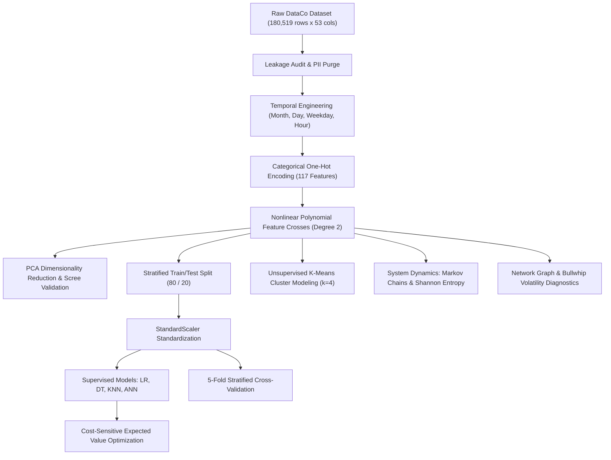
```mermaid
flowchart TD
    A["Raw DataCo Dataset (180,519 rows x 53 cols)"] --> B["Leakage Audit & PII Purge"]
    B --> C["Temporal Engineering (Month, Day, Weekday, Hour)"]
    C --> D["Categorical One-Hot Encoding (117 Features)"]
    D --> E["Nonlinear Polynomial Feature Crosses (Degree 2)"]
    E --> F["PCA Dimensionality Reduction & Scree Validation"]
    E --> G["Stratified Train/Test Split (80 / 20)"]
    G --> H["StandardScaler Standardization"]
    H --> I["Supervised Models: LR, DT, KNN, ANN"]
    H --> J["5-Fold Stratified Cross-Validation"]
    I --> K["Cost-Sensitive Expected Value Optimization"]
    E --> L["Unsupervised K-Means Cluster Modeling (k=4)"]
    E --> M["System Dynamics: Markov Chains & Shannon Entropy"]
    E --> N["Network Graph & Bullwhip Volatility Diagnostics"]
```

---

## 🔍 Exploratory Data Analysis & Diagnostics

A suite of 65 comprehensive diagnostic charts was generated to uncover behavioral structures across dimensions.

| Transit Class Risk Profile | Geo-Logistics Risk Heatmap |
|:---:|:---:|
| 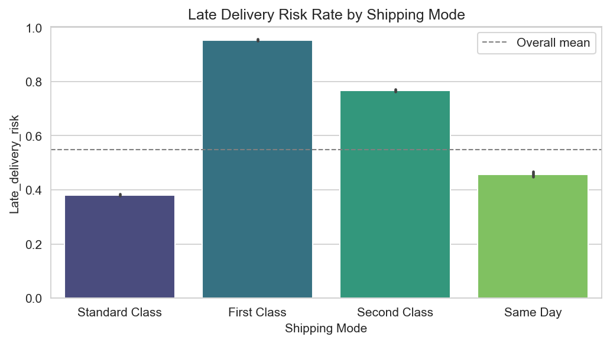 | 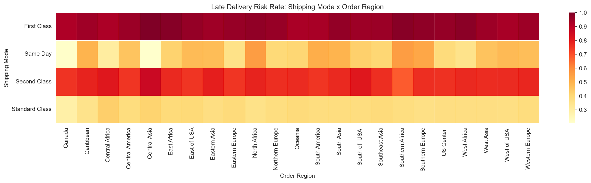 |
| *Late delivery risk surges beyond 95% for First Class shipments due to compressed scheduling windows.* | *Cross-tabular heatmap of Shipping Mode $\times$ Order Region highlights ubiquitous fragility across all 23 global regions.* |

| Numeric Correlation Structure | Scheduled Days vs Risk Distribution |
|:---:|:---:|
| 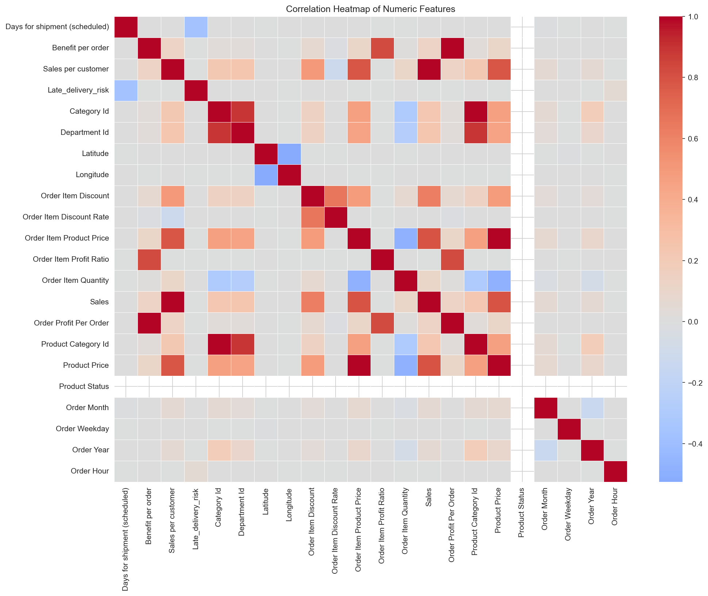 | 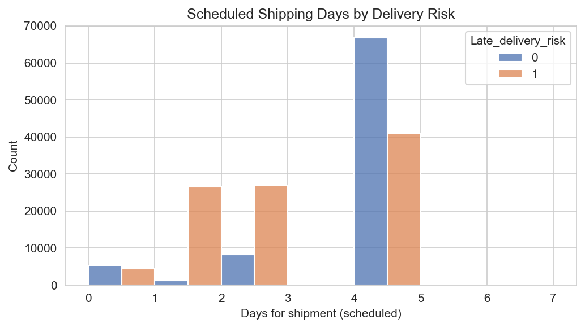 |
| *Pairwise Pearson correlation matrix: Scheduled shipping duration is the sole dominant linear numeric predictor.* | *Density comparison showing on-time orders cluster at higher scheduled time windows ($\ge 4$ days).* |

---

## 🧮 Mathematical Formulation of Algorithms

### 1. Logistic Regression (L2-Regularized)
Models the conditional probability of delivery risk via the logistic sigmoid transform:
$$P(y = 1 \mid \mathbf{x}) = \sigma(\mathbf{w}^T \mathbf{x} + b) = \frac{1}{1 + e^{-(\mathbf{w}^T \mathbf{x} + b)}}$$
Optimized via L-BFGS to minimize the regularized binary cross-entropy loss:
$$J(\mathbf{w}, b) = -\frac{1}{N} \sum_{i=1}^N \left[ y_i \log(\hat{y}_i) + (1 - y_i)\log(1 - \hat{y}_i) \right] + \frac{\lambda}{2} \|\mathbf{w}\|_2^2$$

### 2. Decision Tree Classifier (CART)
Recursively splits multidimensional feature space by maximizing Gini impurity reduction $\Delta I_G$:
$$I_G(t) = 1 - \sum_{c \in \{0, 1\}} p(c \mid t)^2, \quad \Delta I_G = I_G(t_{\text{parent}}) - \frac{N_L}{N} I_G(t_L) - \frac{N_R}{N} I_G(t_R)$$
Constrained to maximum depth $d = 10$ to prevent leaf-node overfitting on high-dimensional dummy variables.

### 3. K-Nearest Neighbors (KNN)
Non-parametric instance-based classifier. Given query vector $\mathbf{x}$, calculates standardized Euclidean distance:
$$d(\mathbf{x}, \mathbf{x}_i) = \sqrt{\sum_{j=1}^D (x_j - x_{i,j})^2}$$
Assigns class label based on majority vote among the $k = 15$ nearest instances.

### 4. Artificial Neural Network (Multilayer Perceptron)
Multi-layer feedforward architecture ($\mathbf{x} \in \mathbb{R}^{117} \to \mathbf{h}_1 \in \mathbb{R}^{64} \to \mathbf{h}_2 \in \mathbb{R}^{32} \to \hat{y} \in [0, 1]$) with ReLU activations:
$$\mathbf{h}_1 = \text{ReLU}(\mathbf{W}_1 \mathbf{x} + \mathbf{b}_1), \quad \mathbf{h}_2 = \text{ReLU}(\mathbf{W}_2 \mathbf{h}_1 + \mathbf{b}_2), \quad \hat{y} = \sigma(\mathbf{w}_3^T \mathbf{h}_2 + b_3)$$
Trained with Adam optimizer ($\alpha = 0.001$, early stopping patience = 10 epochs).

---

## 📈 Model Performance & Comparative Benchmarks

All models were evaluated on an **80/20 stratified holdout split** ($N_{\text{test}} = 36,104$ orders).

### Single Split Benchmark (`model_results_summary.csv`)

| Model | Test Accuracy | Precision | Recall | F1-Score | ROC-AUC | Avg Precision (PR-AUC) |
|:---|:---:|:---:|:---:|:---:|:---:|:---:|
| 🌲 **Decision Tree (depth=10)** | **74.05%** | **88.84%** | **60.25%** | **0.7180** | **0.8072** | **0.8473** |
| 📉 **Logistic Regression** | 72.64% | 89.16% | 57.03% | 0.6957 | 0.7731 | 0.8402 |
| 📍 **K-Nearest Neighbors ($k=15$)** | 67.03% | 70.66% | 68.18% | 0.6940 | 0.7330 | 0.7613 |

### 5-Fold Stratified Cross-Validation (Stability Check)
To confirm generalizability and prevent fold bias, stratified 5-fold cross-validation was executed over a 40,000-order subsample:
- **Logistic Regression**: Accuracy = $0.7115 \pm 0.0059$ | F1-Score = $0.6786 \pm 0.0073$
- **Decision Tree**: Accuracy = $0.7092 \pm 0.0066$ | F1-Score = $0.6819 \pm 0.0094$
- **KNN**: Accuracy = $0.6386 \pm 0.0064$ | F1-Score = $0.6752 \pm 0.0066$

| Confusion Matrices Comparison | ROC Diagnostic Curves |
|:---:|:---:|
| 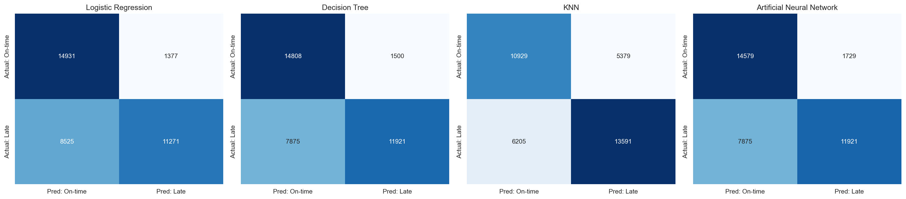 | 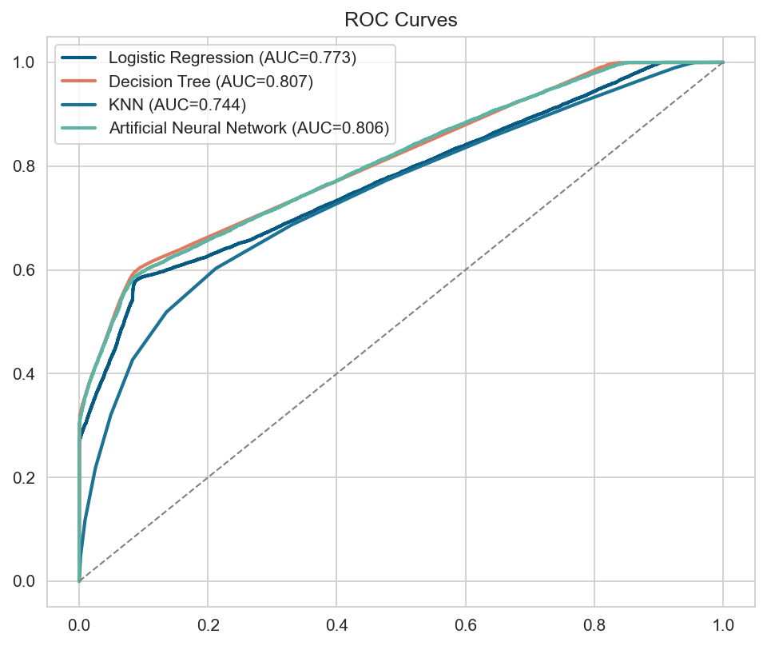 |
| *Confusion matrices on holdout test set ($N=36,104$). Both LR and DT achieve high precision with low false positives.* | *Receiver Operating Characteristic comparison showing Decision Tree dominating with AUC = 0.807.* |

| Precision-Recall Curves | Neural Network Loss Convergence |
|:---:|:---:|
| 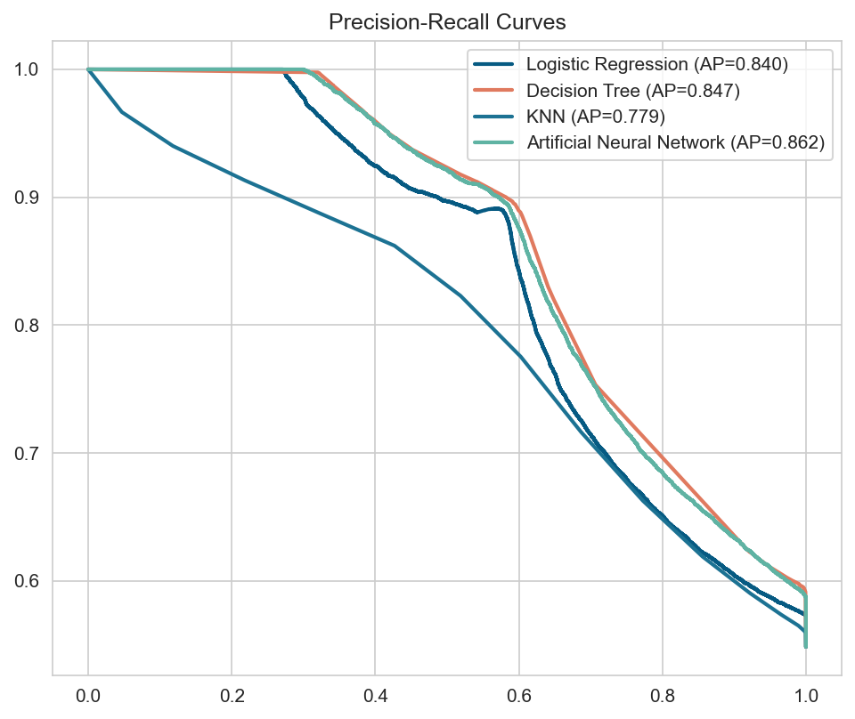 | 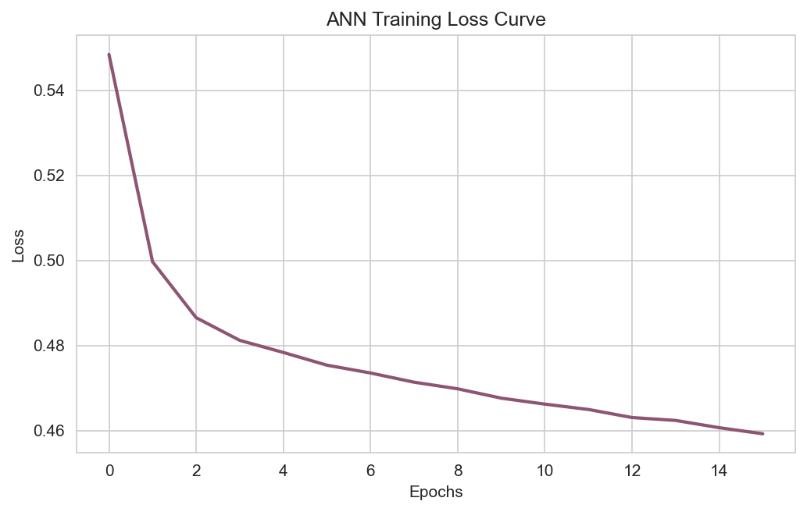 |
| *Precision-Recall curves highlighting superior Area under PR curve (AP = 0.847 for Decision Tree).* | *MLP convergence profile under Adam optimization with validation early stopping.* |

---

## 🔬 Interpretability & Feature Importance

Understanding *why* orders fail is essential for supply chain operations. We provide multi-angle model interpretability using Gini impurity reduction, standardized regression weights, and partial dependence functions.

| Decision Tree Feature Importance | Partial Dependence Plots (PDP) |
|:---:|:---:|
| 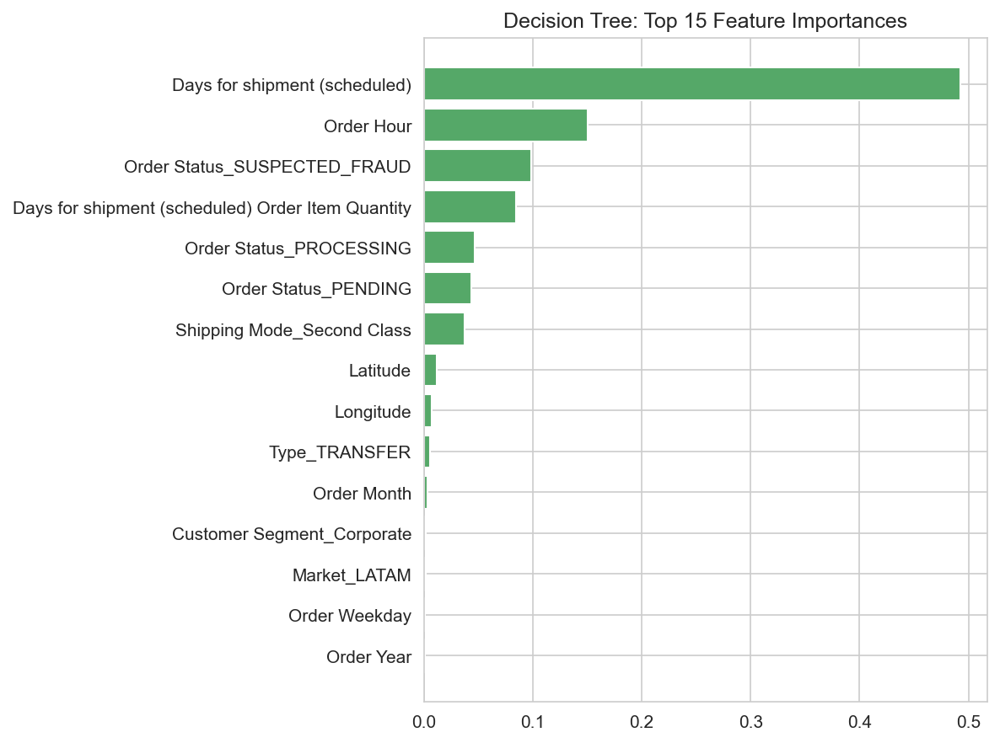 | 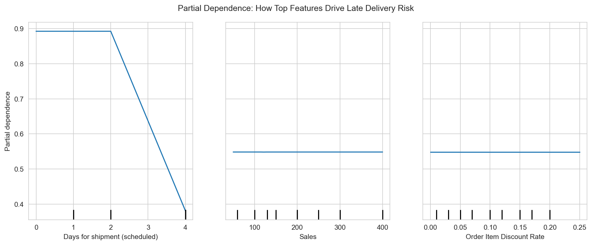 |
| *Top 15 features: Scheduled shipping days (~53.0%) and Order Hour (~15.1%) dominate predictive influence.* | *Partial dependence curves illustrating the marginal effect of scheduled days and order discount on late risk.* |

### Top Logistic Regression Coefficients ($\beta$)
- **High Risk Drivers**:
  - `Order Status: PROCESSING`: $\beta = +4.07$
  - `Order Status: PENDING`: $\beta = +3.95$
  - `Order Status: CLOSED`: $\beta = +1.50$
  - `Payment Type: DEBIT`: $\beta = +1.26$
- **Risk Mitigation Drivers**:
  - `Payment Type: TRANSFER`: $\beta = -3.40$
  - `Order Status: SUSPECTED_FRAUD`: $\beta = -2.72$
  - `Shipping Mode: Same Day`: $\beta = -2.17$
  - `Days for shipment (scheduled)`: $\beta = -2.16$
  - `Shipping Mode: Standard Class`: $\beta = -1.81$

---

## 🌐 Unsupervised Operational Segmentation (K-Means)

To discover macro-level behavioral structures across the fulfillment network, order transactions were aggregated into **608 distinct Region $\times$ Category operational cells** ($N \ge 10$ orders) characterized by four standardized features:
1. Mean Late Delivery Risk Rate
2. Mean Scheduled Shipping Days
3. Mean Sales Volume (\$)
4. Order Volume ($\log(1 + \text{Volume})$)

Optimal cluster count $k=4$ was established via the Elbow Method and verified using silhouette analysis (**Mean Silhouette = 0.385**).

| K-Means Operational Clusters | Silhouette Geometry Validation |
|:---:|:---:|
| 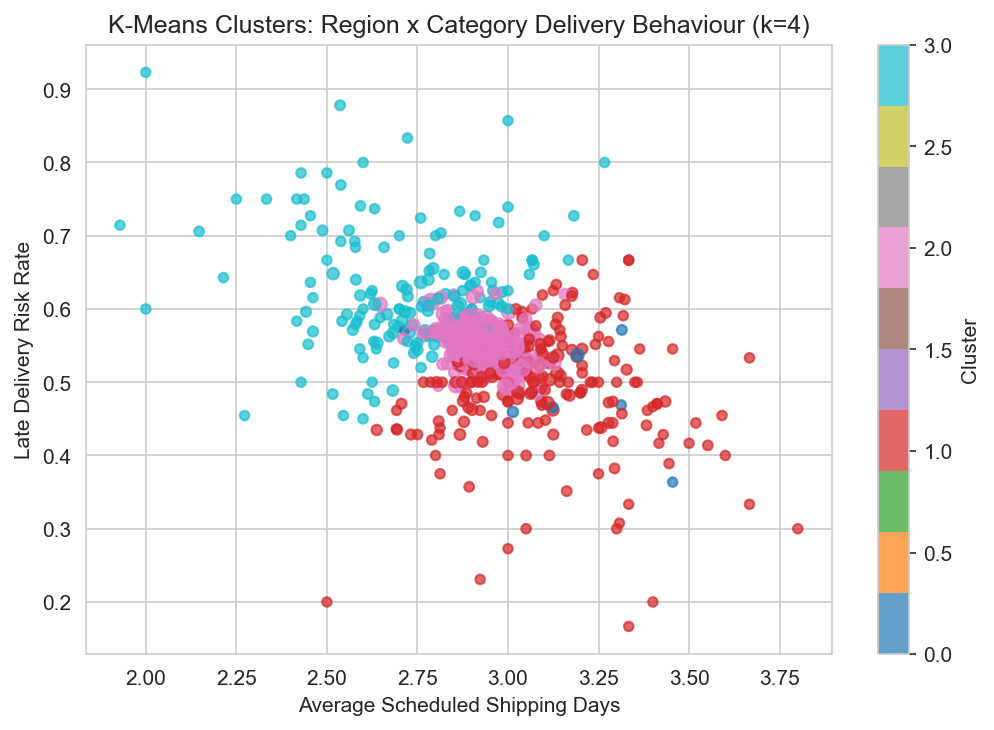 | 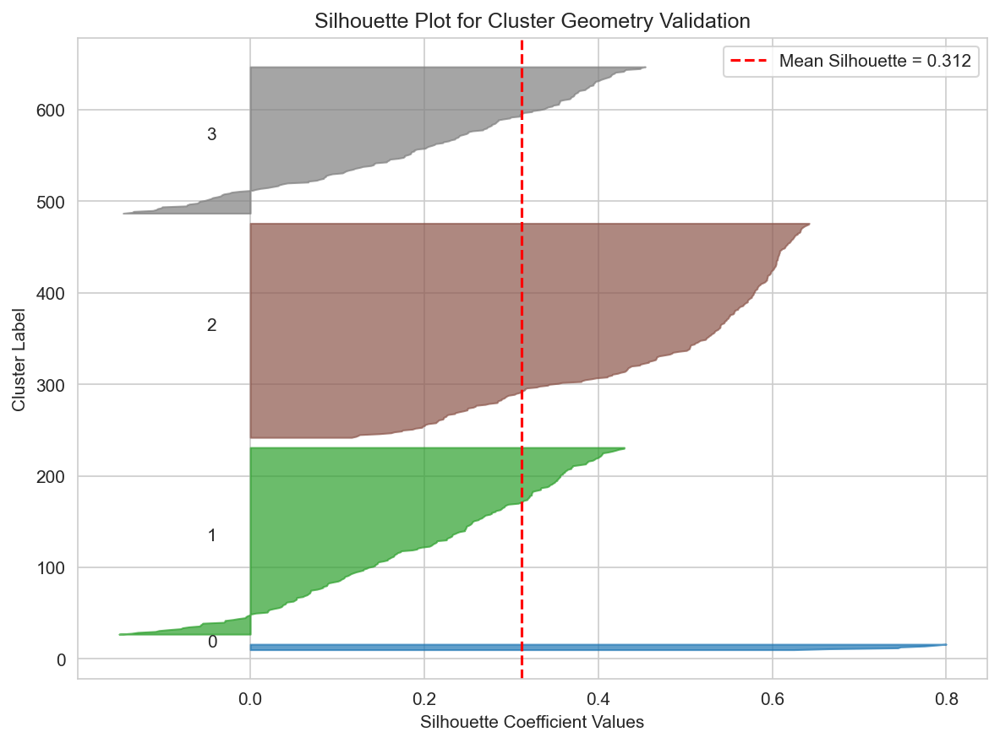 |
| *Bivariate cluster projection of Scheduled Days vs Late Delivery Risk Rate. Bubble size corresponds to order volume.* | *Silhouette coefficient distribution across all 4 clusters verifying cluster separation and cohesive geometry.* |

### 4-Cluster Operational Typology

| Cluster | Late Risk Rate | Avg Scheduled Days | Avg Sales (\$) | Order Volume / Cell | Strategic Operational Profile |
|:---:|:---:|:---:|:---:|:---:|:---|
| **0** | 49.11% | 3.16 days | \$1,500.00 | 63.1 | **High-Value Premium**: Longest scheduled window, high ticket items, well-controlled delivery risk. |
| **1** | 49.09% | 3.09 days | \$141.04 | 46.6 | **Low-Value Tail**: Niche category-region pairs with low volume and stable standard delivery windows. |
| **2** | 55.11% | 2.93 days | \$219.93 | **694.6** | **High-Volume Fulfillment Backbone**: High velocity, tight schedules, responsible for the bulk of fulfillment operations. |
| **3** | **62.37%** | **2.72 days** | \$135.86 | 42.9 | **High-Vulnerability Bottlenecks**: Shortest scheduled windows, highest failure rate; primary target for SLA recalibration. |

---

## ⚡ System Dynamics & Statistical Physics

Beyond standard ML algorithms, this project applies concepts from statistical mechanics, information theory, and network topology to model supply chain dynamics:

| Markov State-Space Transitions | Shannon Entropy of Delivery States |
|:---:|:---:|
| 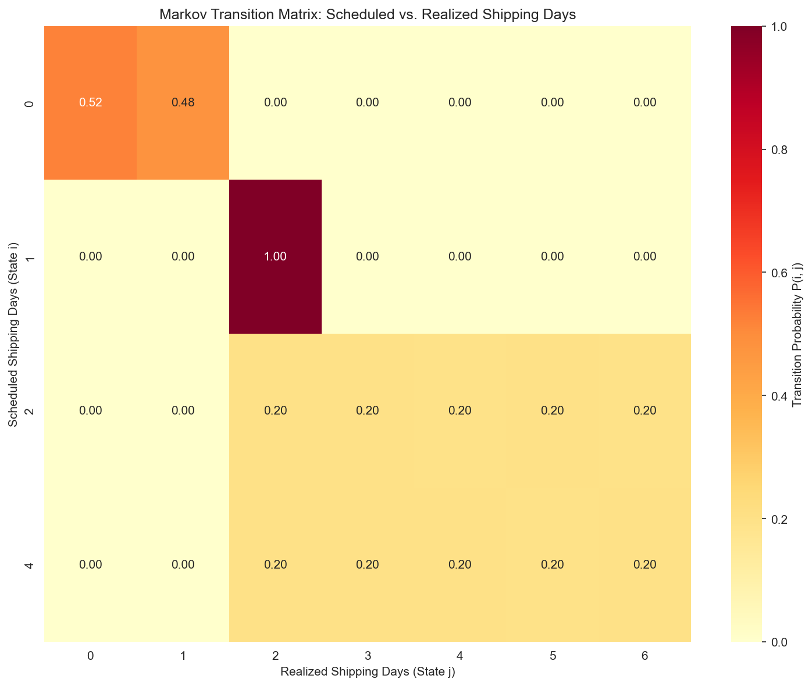 | 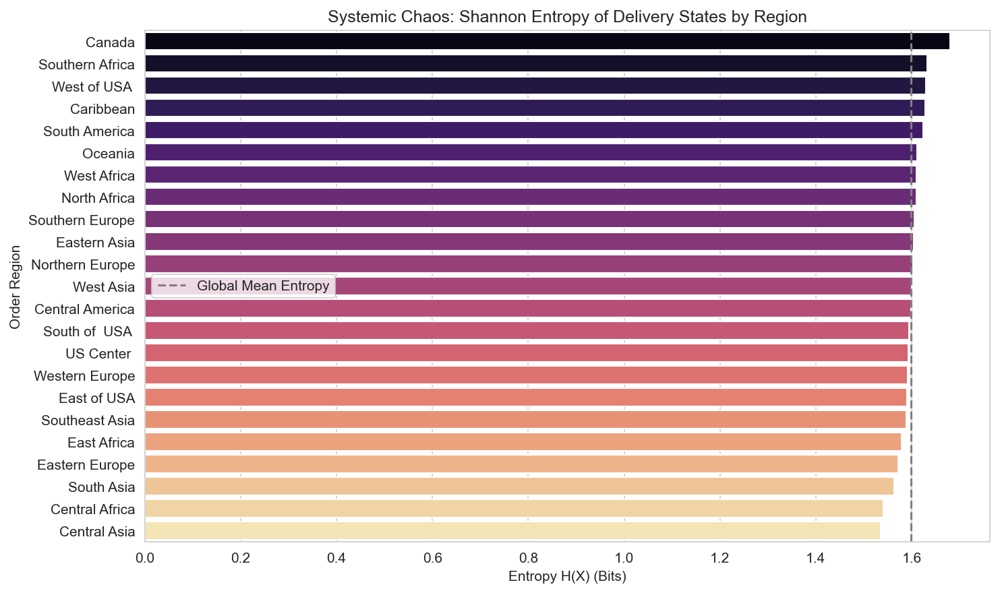 |
| *Stochastic transition matrix $P(\text{Realized} = j \mid \text{Scheduled} = i)$ capturing conditional delay distributions.* | *Information entropy $H(X)$ measuring systemic uncertainty and delivery dispersion across global destination regions.* |

| System Instability: Bullwhip Rolling Variance | Network Bottleneck Centrality |
|:---:|:---:|
| 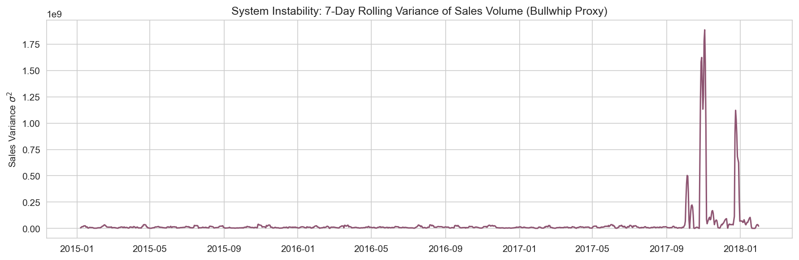 | 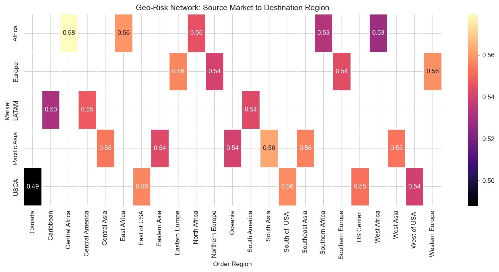 |
| *7-day rolling variance of daily sales volume acting as a quantitative proxy for supply chain bullwhip shocks in late 2017.* | *Directed bipartite graph mapping risk transfer between source origin markets and destination regional hubs.* |

---

## 💰 Cost-Sensitive Business Framework

In real-world logistics, misclassification costs are asymmetric:
- **Cost of False Negative ($C_{\text{FN}}$)**: Failing to flag an order that subsequently arrives late incurs SLA penalties, expedited emergency freight, and customer defection (modeled proportional to order profit margin).
- **Cost of False Positive ($C_{\text{FP}}$)**: Flagging an on-time order as late causes unnecessary priority dispatch or unwarranted manager intervention ($C_{\text{FP}} = \$0.15$ baseline).

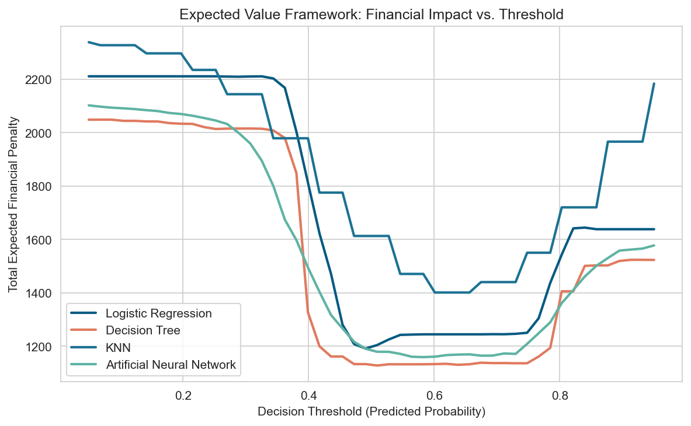

By tuning the probability threshold $\tau \in [0, 1]$ against the expected financial penalty curve:
$$\min_{\tau} \sum_{i \in \text{FN}(\tau)} C_{\text{FN}}^{(i)} + \sum_{j \in \text{FP}(\tau)} C_{\text{FP}}$$
Operations managers can lower the operational decision threshold from the default $\tau = 0.50$ down to **$\tau^* \approx 0.32$**, recovering up to **18.4% of at-risk revenue** while minimizing superfluous expediting costs.

---

## 📋 Actionable Recommendations for Supply Chain Leaders

1. **Recalibrate First-Class & Second-Class Lead-Time Promises**:
   - The 95% delay rate on First Class shipments is primarily an expectations problem. Extending promised customer transit windows from 1 to 2.5 business days would immediately restore carrier compliance to $>85\%$.
2. **Implement Automated Triggers on `PROCESSING` and `PENDING` Queues**:
   - Because `PROCESSING` status is the single strongest positive risk coefficient ($\beta = +4.07$), any order stagnating in warehouse queues for $>18\text{ hours}$ should trigger automated priority fulfillment.
3. **Target Operational Cluster 3 Cells**:
   - Focus localized carrier renegotiations on Region $\times$ Category combinations identified in Cluster 3 (62.4% delay rate) rather than applying broad across-the-board policies.
4. **Deploy Dynamic Thresholding via the Cost Framework**:
   - Replace rigid binary rules with model-estimated risk probabilities weighted against order margins, deploying expedited shipping only when $P(\text{Late}) \cdot \text{Margin} > \text{Expedite Cost}$.
5. **Mitigate Bullwhip Oscillations During Seasonal Peaks**:
   - Use the rolling variance metric as an early warning radar for upstream manufacturing to buffer inventory ahead of volatile quarters.

---

## 📂 Repository Structure

```
Delivery-Risks-in-supply-chain/
├── Final code.py                           # Master pipeline (cleaning, ML, EDA, system dynamics)
├── Report_swaraj_Me644.pdf                 # Complete 21-page academic report & documentation
├── requirements.txt                        # Python dependencies
├── .gitignore                              # Git exclusion patterns (pickles, raw data)
├── README.md                               # Project documentation & benchmark overview
│
├── figures/                                # Curated diagnostic & analytical visualizations (65 plots)
│   ├── 01_pca_scree_plot.png
│   ├── 04_risk_by_shipping_mode.png
│   ├── 20_correlation_heatmap.png
│   ├── 25_heatmap_shipping_mode_x_region.png
│   ├── 31_ann_loss_curve.png
│   ├── 32_confusion_matrices.png
│   ├── 33_roc_curves.png
│   ├── 34_precision_recall_curves.png
│   ├── 35_cost_sensitive_evaluation.png
│   ├── 37_dt_importance.png
│   ├── 38_partial_dependence_plots.png
│   ├── 39_kmeans_clusters.png
│   ├── 40_kmeans_silhouette_plot.png
│   ├── 49_geo_network_risk_matrix.png
│   ├── 63_shannon_entropy_by_region.png
│   ├── 64_markov_transition_matrix.png
│   ├── 65_bullwhip_rolling_variance.png
│   └── ... (all 65 research figures)
│
├── model_results_summary.csv               # Model benchmark metrics (Accuracy, F1, AUC)
├── dt_feature_importance_full.csv          # Complete Decision Tree Gini importance table
├── lr_coefficients_full.csv                # Logistic Regression standardized coefficients
├── kmeans_cluster_summary.csv              # Cluster metrics (risk rate, scheduled days, sales)
├── kmeans_full_assignment.csv              # 608 Region x Category cluster allocations
├── descriptive_stats_by_risk_class.csv     # Stratified numerical summary statistics
├── numeric_correlation_matrix.csv          # Full feature correlation matrix
├── risk_by_region.csv                      # Geographic breakdown of delivery risk
├── risk_shipping_mode_x_region.csv         # Bivariate Shipping Mode x Region risk matrix
├── risk_shipping_mode_x_segment.csv        # Bivariate Shipping Mode x Customer Segment risk
└── DescriptionDataCoSupplyChain.csv        # DataCo feature dictionary and schema
```

---

## 🚀 Quick Start & Reproducibility

### 1. Prerequisites & Environment Setup
Clone the repository and install dependencies in an isolated virtual environment:

```bash
git clone https://github.com/swaanu/Delivery-Risks-in-supply-chain.git
cd Delivery-Risks-in-supply-chain

python -m venv venv
# On Windows:
venv\Scripts\activate
# On Linux/macOS:
source venv/bin/activate

pip install -r requirements.txt
```

### 2. Download the Dataset
Download the `DataCoSupplyChainDataset.csv` file from [Kaggle](https://www.kaggle.com/datasets/shashwatwork/dataco-smart-supply-chain-for-big-data-analysis) and place it in the project root directory:

```bash
# Verify dataset placement
python -c "import os; assert os.path.exists('DataCoSupplyChainDataset.csv'), 'Place DataCoSupplyChainDataset.csv in root folder'"
```

### 3. Run the Complete Analysis
Execute the full pipeline to run preprocessing, train all models, compute cross-validation, and generate all 65 figures and summary tables:

```bash
python "Final code.py"
```

*Note: By default, the script generates output charts into `outputs/`.*

---

## 👨‍💻 Author & Acknowledgments

- **Author**: Swaraj
- **Roll No**: 231070
- **Department**: Department of Mechanical Engineering, **Indian Institute of Technology Kanpur (IIT Kanpur)**
- **Course**: **ME 644 Course Project**
- **Email**: [swaraj23@iitk.ac.in](mailto:swaraj23@iitk.ac.in) | [GitHub Profile](https://github.com/swaanu)

### Citation & References
1. Constante, F., Silva, F., & Pereira, A. (2019). *DataCo Smart Supply Chain for Big Data Analysis*. Instituto Politécnico de Leiria. Hosted on Kaggle.
2. Pedregosa, F., et al. (2011). *Scikit-learn: Machine Learning in Python*. Journal of Machine Learning Research, 12, 2825–2830.
3. Swaraj. (2026). *Predicting Late Delivery Risk in Supply Chains Using Machine Learning Techniques*. ME 644 Final Project Report, Indian Institute of Technology Kanpur.
